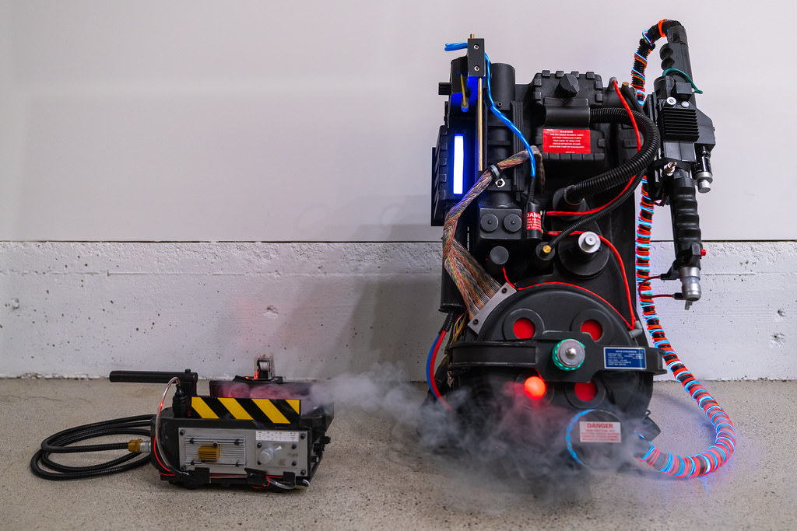
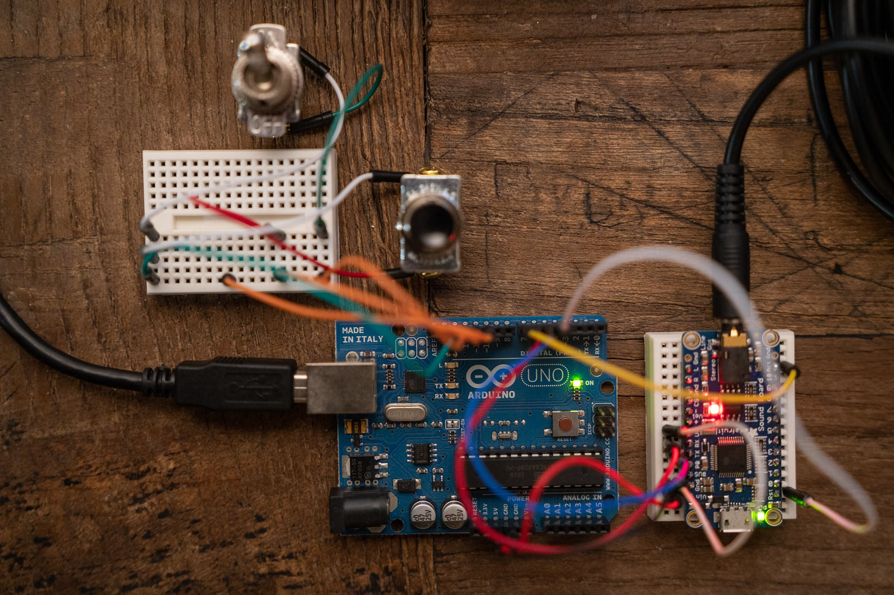
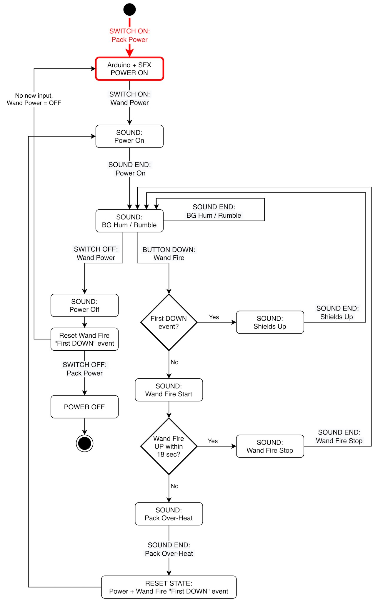
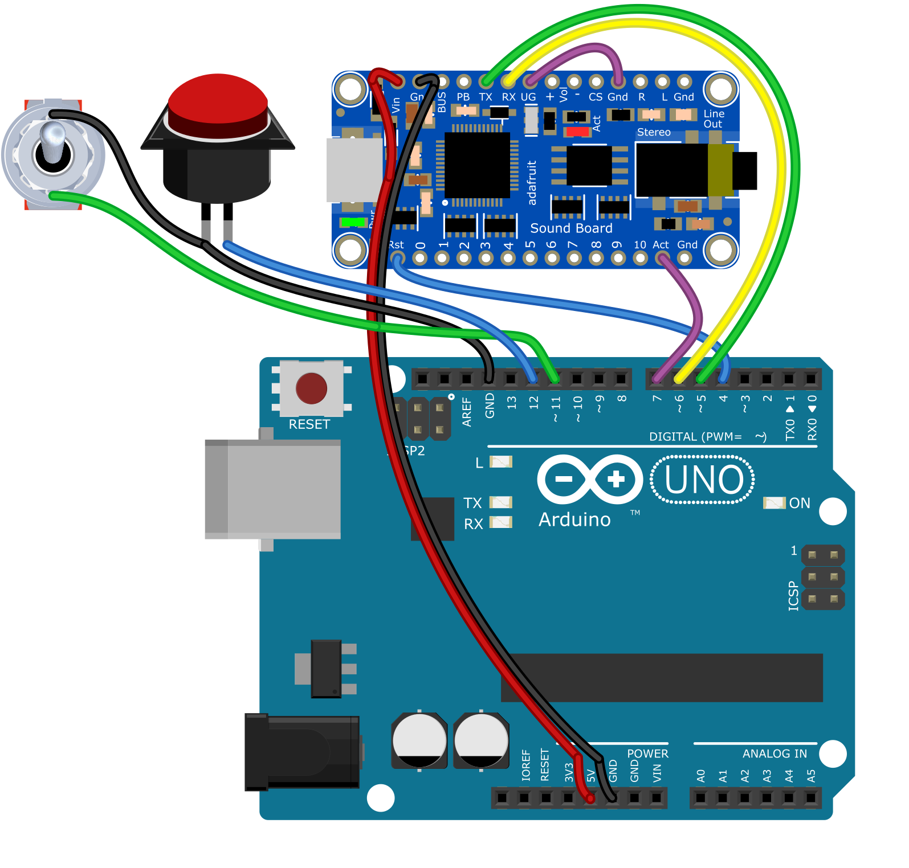

”Ghostbusters“ (1984) Proton Pack: “DIY” Sound Effects Module
=============================================================

YouTube video: [Tech demo, hardware, wiring and code walk-through](https://youtu.be/2IxWJWbTv5s), ~35 min.

## “You're never going to regret this, Ray.”
**Motivation**

In short, I wanted both CD-quality, and _more_, sound effects for my own proton pack—or should I say—unlicensed nuclear accelerator.



**Note**: This project is about assembling and programming the sound effects module, only. This does not cover any other Ghostbusters-related props, or lighting, or anything else.

**How it started**

In 2015, I got a prop shop-made proton pack which included the then-standard “Matty Collector” Neutrino wand. The wand had its own sound effects, as well as a 3.5mm line-out jack.

In my case, the Matty wand's line-out ran to a 12V car audio-style amplifier and speaker in the pack. The sound was _okay_, but not _great_ - and it didn't seem to have all the features I expected.

## Hardware
> _“Generally you don't see that kind of behaviour in a major appliance.”_

Based on the first Ghostbusters film, the proton pack has at least one power switch and one “fire” button for its typical operations: Powering up, down, and fire start/stop.

I decided to use the Arduino platform based on prior experience. For playing sound, the Adafruit Audio FX Sound Board module (16 MB version) looked like a good fit. It can play CD-quality .WAV or .OGG files with relatively low latency, and it can be controlled by the Arduino via (serial) UART.

Here is an early working prototype. Aside from the Adafruit Sound Board, most other components can be found via places like Amazon or hobby / electronics shops. Pardon a few redundant wires, and the breadboard for the power switch and fire button.



## Features
> _“I collect spores, molds and fungus.”_

Included sounds and sequences:
* Pack: “Power on”, “Power off” sounds
* “Shields up” sound (first time pressing “fire” button)
* Neutrina wand: “Fire start” (press), “Firing” (hold), “Fire stop” (release) sounds
* Neutrina wand / pack: Overheat warning, overheat, shut-down / exhaust / restart sound sequence

This is an approximation of the sequence, and logic flow of the proton pack sounds: from power on, to firing, to overheat / reset, and power off. A live visualization of this is shown in the [Tech demo video](https://www.youtube.com/watch?v=2IxWJWbTv5s&t=170s).



## Requirements
> _“We have the tools, we have the talent!”_

Skills, software, and hardware you will need:
* Familiarity with basic electronics and Arduino platform
* Arduino Uno (USB-B) or Nano (USB mini)
* Adafruit Audio FX Sound Board (USB micro)
* Computer with Arduino IDE app + Adafruit library
* Breadboards, switch, button, wire
* Soldering iron (FX header pins)

## Technical Considerations
To build this, you will need to be able to:
* Solder header pins to the Adafruit Audio FX Sound Board
* Copy .WAV files (or flash a disk image) to the Sound Board from a computer
* Connect wires between the Arduino and Sound Board per a schematic
* Install and add required Adafruit libraries to the Arduino IDE
* Troubleshoot, compile and upload code from the IDE to your Arduino

## Wiring List and Schematic
> _“There's something very important I forgot to tell you ... Don't cross the streams. It would be bad.”_

Connections, mostly between the Arduino and Sound Board unless noted otherwise:
```
/\/\/\/\/\/\/\/\/\
| W I R I N G -> |
\/\/\/\/\/\/\/\/\/
------------------
UNO 5V  -> SFX Vin
UNO GND -> SFX Gnd
UNO GND -> PB1,P1*
UNO GND -> SW1,P1*
UNO 12  -> PB1,P2*
UNO 11  -> SW1,P2*
UNO 4   -> SFX Rst
UNO 7   -> SFX Act
UNO 6   -> SFX RX
UNO 5   -> SFX TX
SFX UG  -> SFX Gnd
------------------
*  PB1/SW1: Pushbutton / Switch (pin 1 or 2)
```
Illustrated schematic, rendred via Fritzing:


## Compiling and Uploading `.ino` Code to the Arduino
You will need to download and install the Arduino IDE on a computer, as well as the `Adafruit_Soundboard` library from Adafruit.

Once installed, you should be able to open the `ghostbusters_adafruit_soundboard.ino` Arduino program source code in the Arduino IDE, and “verify” (compile) it without errors.

In the IDE, you will need to set your board appropriately (e.g., Uno or Nano), and find the right port to upload to when your device is connected via USB.

When compilation has succeeded, your device is connected and the right port is set, you should be able to upload the code to the Arduino and see that it is working.

It can be helpful to change the `DEBUG` constant in the code to `1` or `2` to enable serial debug output, which can be seen in the Arduino IDE's Serial Monitor.

Side note: If using an “off-brand” Arduino Nano, I found you may need to try changing the processor type if uploading doesn't work.

## Resources and Links
Adafruit Audio FX Sound Board: Tutorial, pinouts, power, copying files etc.    
https://learn.adafruit.com/adafruit-audio-fx-sound-board/

Adafruit Audio FX Sound Board: 16 MB version, $24.95 USD  
https://www.adafruit.com/product/2220

Arduino IDE software (free)  
https://www.arduino.cc/en/software/

`Adafruit_Soundboard` library for Arduino IDE (download, required to compile and upload code to your Arduino)  
https://learn.adafruit.com/adafruit-audio-fx-sound-board/serial-audio-control

Official Arduino Tutorials  
https://www.arduino.cc/en/Tutorial/HomePage/